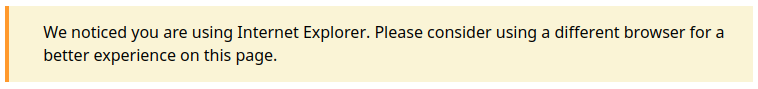
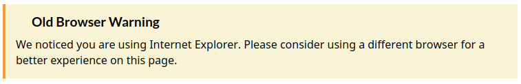
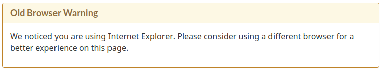

# IE Gang [](https://www.npmjs.com/package/ie-gang)

Warn users of slow performance/reduced interactivity when viewing data intensive web apps & visualizations in IE 6-11.

- **NPM:** https://www.npmjs.com/package/ie-gang

## Installation

```bash
npm i ie-gang
```

## Usage

The latest [web experience toolkit (WET) and/or GCWeb](https://wet-boew.github.io/wet-boew/index-en.html) css and js files should be included in your web app folder and your main/index.html like so:

```html
<head>
  <link href="./GCWeb/assets/favicon.ico" rel="icon" type="image/x-icon" />
  <link rel="stylesheet" href="./GCWeb/css/theme.min.css" />
  <noscript
    ><link rel="stylesheet" href="./GCWeb/wet-boew/css/noscript.min.css"
  /></noscript>
</head>

<body>
  <script src="https://ajax.googleapis.com/ajax/libs/jquery/2.2.4/jquery.js"></script>
  <script src="./GCWeb/wet-boew/js/wet-boew.min.js"></script>
</body>
```

ie-gang will look for a div with an id="ie-warning". The GoC styled warning message will appear in this div.

```html
<body>
  <div id="ie-warning"></div>
</body>
```

### Alert bar without title

The ieWarn function will likely be imported and called somewhere in your index.js file like so:

```javascript
import ieWarn from "ie-gang";
let warningParams = {
  message:
    "We noticed you are using Internet Explorer. Please consider using a different browser for a better experience on this page.",
  type: "alert",
  title: false,
};
ieWarn(warningParams);
```



### Alert bar with title

```javascript
import ieWarn from "ie-gang";
let warningParams = {
  message:
    "We noticed you are using Internet Explorer. Please consider using a different browser for a better experience on this page.",
  type: "alert",
  title: "Old Browser Warning",
};
ieWarn(warningParams);
```



### Alert panel

```javascript
import ieWarn from "ie-gang";
let warningParams = {
  message:
    "We noticed you are using Internet Explorer. Please consider using a different browser for a better experience on this page.",
  type: "panel",
  title: "Old Browser Warning",
};
ieWarn(warningParams);
```


